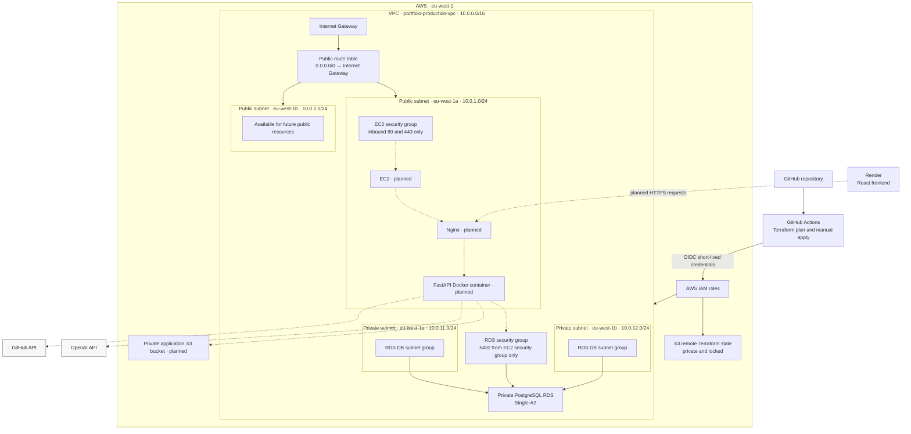

# Portfolio Infrastructure

This repository manages the AWS infrastructure for an AI-powered portfolio
application. Terraform defines the production environment, while GitHub Actions
uses AWS OpenID Connect (OIDC) authentication to plan and apply infrastructure
changes without storing long-lived AWS access keys.

## Project Purpose

The project is a practical demonstration of:

- Infrastructure as Code with Terraform;
- AWS networking across public and private subnets;
- secure, private database design;
- CI/CD controls for infrastructure changes;
- IAM role assumption through GitHub OIDC; and
- production-oriented decisions balanced against the needs and cost profile of
  a low-traffic portfolio application.

It documents both what is running today and the intended path toward hosting the
FastAPI backend on AWS.

## Architecture

Solid lines represent deployed infrastructure or active delivery paths. Dashed
lines and nodes labelled **planned** show the intended runtime architecture.



The private subnets have no direct route to the internet. The future EC2
instance will expose the application only through Nginx on ports 80 and 443;
FastAPI port 8000 will not be public.

## Current Deployment Status

| Status | Component | Purpose |
|---|---|---|
| Completed | Terraform remote state | Stores encrypted production state in a private S3 backend with S3 lock files enabled. |
| Completed | GitHub OIDC | Allows GitHub Actions to assume AWS IAM roles with short-lived credentials. |
| Completed | GitHub Actions plan | Formats, initializes, validates, and plans eligible Terraform changes on pull requests to `main`. |
| Completed | GitHub Actions manual apply | Applies reviewed production changes from `main` when manually dispatched. |
| Completed | VPC | Provides an isolated `10.0.0.0/16` network for the production environment. |
| Completed | Public subnets | Provide public tiers in `eu-west-1a` and `eu-west-1b`. |
| Completed | Private subnets | Provide database tiers in `eu-west-1a` and `eu-west-1b` without direct internet routes. |
| Completed | Internet Gateway | Connects the VPC's public routing tier to the internet. |
| Completed | Public route table | Routes `0.0.0.0/0` to the Internet Gateway. |
| Completed | Public subnet associations | Associate both public subnets with the public route table. |
| Completed | EC2 security group | Allows inbound HTTP and HTTPS for the future application host, with no SSH or FastAPI rule. |
| Completed | RDS security group | Allows PostgreSQL only from resources using the EC2 security group. |
| Completed | RDS DB subnet group | Makes both private subnets available to RDS across two Availability Zones. |
| Completed | PostgreSQL RDS | Runs the encrypted, private production database. |
| Completed | Secrets Manager-managed RDS credential | Lets RDS generate and manage the master password in AWS Secrets Manager. |
| Planned | EC2 IAM role | Grants the future application host narrowly scoped AWS access. |
| Planned | EC2 instance | Hosts Nginx and the FastAPI Docker container in a public subnet. |
| Planned | Elastic IP | Gives the application host a stable public IPv4 address. |
| Planned | Systems Manager access | Provides administrative access without exposing SSH. |
| Planned | Docker bootstrap | Installs and configures the backend container runtime. |
| Planned | Nginx | Terminates web traffic and proxies requests to FastAPI. |
| Planned | Backend deployment | Runs the FastAPI application and its database migrations. |
| Planned | Private S3 bucket | Stores CV files without public bucket access. |
| Planned | CV upload | Adds controlled CV upload and download through the application. |
| Planned | Domain and HTTPS | Provides a custom domain and encrypted public traffic. |
| Planned | CloudWatch logging | Centralizes application and infrastructure logs. |
| Planned | CloudWatch alarms | Adds operational alerts for selected health and capacity signals. |
| Planned | Backup and recovery testing | Verifies that backups can support a documented recovery process. |

## Infrastructure Decisions

### Custom VPC

A custom VPC makes the network boundaries explicit and reproducible. It avoids
depending on account-specific default VPC configuration and gives the project
control over CIDR allocation, Availability Zones, routes, subnet tiers, and
security-group relationships.

### Public and Private Subnets

The planned EC2 instance will run in a public subnet because it needs to receive
web traffic and call external services. PostgreSQL runs in private subnets with
public accessibility disabled. This keeps the database off the public internet
while allowing the application tier to connect on port 5432 through a
security-group reference.

### No NAT Gateway Initially

A NAT Gateway would introduce a recurring cost, and no application server
currently runs in a private subnet and requires outbound internet access. The
private database does not need that path. A NAT Gateway can be added later if a
private application tier or another outbound-access requirement justifies it.

### EC2 Instead of ECS

The application has very low expected traffic, so a single EC2 host is a
cost-conscious first deployment. It avoids the additional recurring components
commonly paired with ECS, such as an Application Load Balancer, provides direct
operational control, and builds on existing Linux and Docker experience. ECS can
be reconsidered if availability, traffic, or operational requirements grow.

### Private RDS

The RDS instance has no public database endpoint. Its security group accepts
PostgreSQL traffic only from the EC2 security group, storage is encrypted, and
the master password is generated and managed by RDS in Secrets Manager.

### Single-AZ RDS

Single-AZ is appropriate for the current low-traffic portfolio and its
cost-conscious starting point. Multi-AZ would be considered when the
application has stronger availability and recovery requirements.

### GitHub OIDC

GitHub Actions does not store long-lived AWS access keys. Plan and apply jobs
request short-lived AWS credentials by assuming dedicated IAM roles through
OIDC.

### Manual Apply Approval

Terraform changes normally move from `dev` to `main` through a pull request,
where the plan can be reviewed. After merge, infrastructure creation or
modification occurs only when the apply workflow is manually dispatched on
`main`. This creates a deliberate review boundary before production changes.

## AWS Resources

### Network

| Resource | Configuration |
|---|---|
| VPC | `portfolio-production-vpc` — `10.0.0.0/16` |
| Public subnet A | `portfolio-production-public-eu-west-1a` — `10.0.1.0/24` |
| Public subnet B | `portfolio-production-public-eu-west-1b` — `10.0.2.0/24` |
| Private subnet A | `portfolio-production-private-eu-west-1a` — `10.0.11.0/24` |
| Private subnet B | `portfolio-production-private-eu-west-1b` — `10.0.12.0/24` |
| Public routing | Both public subnets use a route table with `0.0.0.0/0` directed to the Internet Gateway. |
| Private routing | Private subnets retain the VPC local route only; no NAT Gateway or direct internet route is configured. |

### Security Groups

| Security group | Inbound rules |
|---|---|
| `portfolio-production-ec2-sg` | TCP 80 and 443 from `0.0.0.0/0`. No inbound SSH and no public port 8000. |
| `portfolio-production-rds-sg` | TCP 5432 only from `portfolio-production-ec2-sg`. No public PostgreSQL rule. |

### RDS

| Setting | Value |
|---|---|
| Identifier | `portfolio-production-postgres` |
| Engine | PostgreSQL `18.3` |
| Instance class | `db.t4g.micro` |
| Availability | Single-AZ |
| Network access | Private; public accessibility disabled |
| Storage | Encrypted `gp3`, 20 GiB initially, autoscaling up to 30 GiB |
| Database name | `portfolio` |
| Master username | `portfolio_admin` |
| Master password | Generated and managed by RDS in AWS Secrets Manager |
| Automated backup retention | One day under the current AWS Free plan limitation |

Passwords, secret values, complete connection strings, and AWS credentials are
intentionally excluded from this documentation.

## Repository Structure

```text
.
├── bootstrap/                   # Placeholder for state/bootstrap configuration
├── environments/
│   └── production/              # Active eu-west-1 production composition
├── modules/
│   ├── networking/              # Implemented VPC, subnets, routing, groups
│   ├── database/                # Implemented PostgreSQL RDS instance
│   ├── storage/                 # Planned application storage module
│   ├── secrets/                 # Planned application secrets module
│   └── monitoring/              # Planned logging and alarms module
└── .github/
    └── workflows/               # Terraform plan and manual apply workflows
```

The production environment currently calls only the
[`networking`](modules/networking/) and [`database`](modules/database/) modules.
The [`storage`](modules/storage/), [`secrets`](modules/secrets/), and
[`monitoring`](modules/monitoring/) directories contain empty Terraform
placeholders and are not active infrastructure. The
[`bootstrap`](bootstrap/) directory is also currently a placeholder; the
existing remote backend is configured in
[`environments/production/backend.tf`](environments/production/backend.tf).

## Terraform Workflow

The normal infrastructure delivery path is:

1. Create Terraform changes on `dev`.
2. Open a pull request from `dev` to `main`.
3. GitHub Actions runs Terraform formatting, initialization, validation, and
   plan for eligible infrastructure changes.
4. Review the Terraform plan.
5. Merge the pull request into `main`.
6. Manually run the Terraform Apply workflow on `main`.
7. Terraform stores encrypted state remotely in S3 and uses an S3 lock file to
   prevent concurrent state operations.

The plan workflow is intentionally scoped to changes under `environments/`,
`modules/`, or its own workflow file, and currently requires `dev` as the pull
request head branch. Documentation-only pull requests do not run a Terraform
plan.

## Local Development

Use local checks to catch formatting and whitespace issues:

```bash
terraform fmt -recursive
terraform fmt -check -recursive
git diff --check
```

Terraform plan and apply run through GitHub Actions using OIDC. Do not apply the
production environment locally. If local validation requires initialization,
run `terraform init` from `environments/production` using the configured S3
backend and an AWS profile with appropriate access.

## Environment and Naming

| Setting | Value |
|---|---|
| AWS Region | `eu-west-1` |
| Environment | `production` |
| Project | `ai-powered-portfolio` |
| Resource naming prefix | `portfolio-production` |
| Default tag keys | `Project`, `Environment`, `ManagedBy`, `Owner` |

The provider supplies these tags by default:
`Project=ai-powered-portfolio`, `Environment=production`,
`ManagedBy=Terraform`, and `Owner=Tshimbiluni`.

## Security Model

- SSH is not exposed. Administration of the future EC2 instance through
  Systems Manager Session Manager is planned, not currently active.
- FastAPI port 8000 is not public; the future Nginx layer will receive traffic
  on ports 80 and 443.
- RDS is private and trusts only the EC2 security group for PostgreSQL traffic.
- GitHub Actions uses OIDC and short-lived role credentials instead of
  long-lived AWS access keys.
- RDS generates and manages the database master password in Secrets Manager.
- Terraform state is stored in an encrypted, private S3 backend with locking.
- Public access is enabled only where required by the planned web entry point;
  the database is not publicly accessible and the planned application bucket
  will be private.

## Cost Awareness

The running RDS instance, its allocated storage, and the AWS-managed Secrets
Manager secret can create recurring charges. Future EC2 compute, its public IPv4
address, and application S3 usage will also add cost when provisioned.

The VPC, subnets, route tables, Internet Gateway attachment, and security groups
do not have meaningful hourly charges by themselves, although traffic and other
services used through them can still be billed.

The first version intentionally avoids a NAT Gateway, Application Load
Balancer, Multi-AZ RDS deployment, and ECS to keep the architecture aligned
with the application's current scale and budget.

## Roadmap

### Completed: Network Foundation

- VPC;
- public and private subnets across two Availability Zones;
- Internet Gateway and public routing; and
- EC2 and RDS security groups.

### Completed: Database Foundation

- RDS DB subnet group;
- private PostgreSQL RDS instance; and
- RDS-managed master credential in Secrets Manager.

### Next: Compute

- EC2 IAM role and instance profile;
- EC2 instance;
- Elastic IP; and
- Systems Manager Session Manager access.

### Next: Application Deployment

- Docker and Nginx;
- Alembic database migrations;
- backend environment configuration; and
- OpenAI and GitHub API integration.

### Next: Storage and Operations

- private S3 storage;
- CV upload and download;
- CloudWatch logging and alarms;
- domain and HTTPS; and
- backup and recovery testing.

## Lessons Learned

- A VPC becomes useful through the combination of subnets, routes, gateways,
  and security controls rather than through any single resource.
- Automatic public IP assignment alone does not make a subnet public; the
  subnet also needs a route to an Internet Gateway.
- RDS requires a DB subnet group spanning subnets in at least two Availability
  Zones even when the database instance itself is Single-AZ.
- Referencing one security group from another expresses application-to-database
  trust without maintaining changing IP allowlists.
- OIDC gives CI jobs short-lived AWS credentials and avoids storing reusable
  access keys in GitHub.
- Reviewing a Terraform plan before apply makes proposed production changes
  visible before they are executed.
- AWS Free plan limitations can shape design choices; in this environment they
  currently constrain automated backup retention to one day.

## Related Repository

The
[Tshimbiluni AI-powered Portfolio](https://github.com/TshimbiluniRSA/Tshimbiluni-AI-powered-Portfolio)
repository contains the React frontend and FastAPI backend supported by this
infrastructure.

## Author

**Tshimbiluni Nedambale**

GitHub: [TshimbiluniRSA](https://github.com/TshimbiluniRSA)

