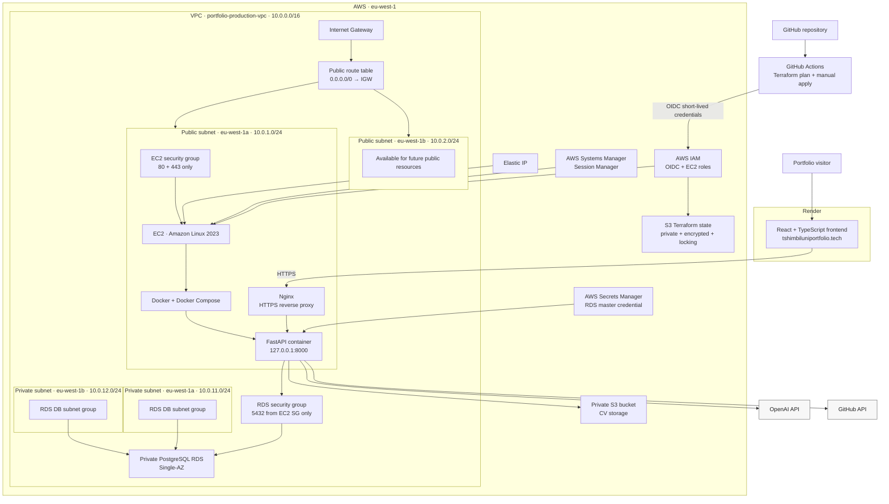

# Portfolio Infrastructure

[](environments/production)
[](modules)
[](.github/workflows)

**Live application:** [tshimbiluniportfolio.tech](https://tshimbiluniportfolio.tech) · **Production API:** [api.tshimbiluniportfolio.tech](https://api.tshimbiluniportfolio.tech) · **Application code:** [Tshimbiluni-AI-powered-Portfolio](https://github.com/TshimbiluniRSA/Tshimbiluni-AI-powered-Portfolio)

**At a glance:** Production AWS deployment, not just a design document — EC2 + Docker backend behind Nginx, private RDS, private S3, GitHub OIDC CI/CD, zero long-lived AWS keys, and zero SSH exposure.

**Demonstrates:** VPC design with public/private subnet segmentation, least-privilege security groups, private RDS with Secrets Manager-managed credentials, GitHub OIDC, Terraform remote state with locking, EC2 administration through Systems Manager, Docker-based deployment, private object storage, HTTPS reverse proxying, and cost-conscious architecture decisions documented inline.

## Project Purpose

This repository manages the AWS production infrastructure for my AI-powered software engineering portfolio.

Terraform defines the infrastructure in AWS `eu-west-1`, while GitHub Actions uses AWS OpenID Connect (OIDC) to plan and apply infrastructure changes without storing long-lived AWS access keys.

The production architecture currently runs the FastAPI backend on Amazon EC2 behind Nginx, with PostgreSQL on private Amazon RDS, CV storage in Amazon S3, AWS Secrets Manager-managed database credentials, and Systems Manager Session Manager for administrative access without SSH.

The React frontend remains independently hosted on Render and communicates with the AWS backend over HTTPS.

The project is a practical demonstration of:

* Infrastructure as Code with Terraform;
* AWS networking across public and private subnets;
* secure, private database design;
* EC2 compute and container hosting;
* private object storage with Amazon S3;
* IAM roles and least-privilege application access;
* AWS Systems Manager administration instead of SSH;
* CI/CD controls for infrastructure changes;
* IAM role assumption through GitHub OIDC;
* Docker-based FastAPI deployment behind Nginx;
* HTTPS and custom-domain configuration; and
* production decisions balanced against the cost profile of a low-traffic application.

## Architecture

The React frontend is hosted separately on Render while the backend and supporting data services run in AWS.



FastAPI itself is not exposed directly to the internet. Nginx receives public HTTP/HTTPS traffic and proxies requests internally to the application on `127.0.0.1:8000`.

SSH is not exposed. Administrative access to EC2 is performed through AWS Systems Manager Session Manager.

## Public Endpoints

| Service           | URL                                            |
| ----------------- | ---------------------------------------------- |
| Portfolio         | `https://tshimbiluniportfolio.tech`            |
| Backend API       | `https://api.tshimbiluniportfolio.tech`        |
| API documentation | `https://api.tshimbiluniportfolio.tech/docs`   |
| Health check      | `https://api.tshimbiluniportfolio.tech/health` |
| Readiness check   | `https://api.tshimbiluniportfolio.tech/ready`  |

## Current Deployment Status

| Status      | Component                              | Purpose                                                                                    |
| ----------- | -------------------------------------- | ------------------------------------------------------------------------------------------ |
| ✅ Completed | Terraform remote state                 | Stores encrypted production state in a private S3 backend with S3 lock files enabled.      |
| ✅ Completed | GitHub OIDC                            | Allows GitHub Actions to assume AWS IAM roles using short-lived credentials.               |
| ✅ Completed | GitHub Actions plan                    | Formats, initializes, validates, and plans eligible Terraform changes.                     |
| ✅ Completed | GitHub Actions manual apply            | Applies reviewed production changes from `main` through manual dispatch.                   |
| ✅ Completed | VPC                                    | Provides the isolated `10.0.0.0/16` production network.                                    |
| ✅ Completed | Public subnets                         | Provide public tiers across `eu-west-1a` and `eu-west-1b`.                                 |
| ✅ Completed | Private subnets                        | Provide isolated database tiers across two Availability Zones.                             |
| ✅ Completed | Internet Gateway                       | Provides internet connectivity to the public tier.                                         |
| ✅ Completed | Public route table                     | Routes `0.0.0.0/0` through the Internet Gateway.                                           |
| ✅ Completed | EC2 security group                     | Exposes HTTP and HTTPS only; SSH and FastAPI port 8000 remain private.                     |
| ✅ Completed | RDS security group                     | Allows PostgreSQL only from the EC2 security group.                                        |
| ✅ Completed | RDS DB subnet group                    | Provides private RDS networking across two Availability Zones.                             |
| ✅ Completed | PostgreSQL RDS                         | Runs the encrypted private production database.                                            |
| ✅ Completed | Secrets Manager-managed RDS credential | Stores the AWS-generated database master credential.                                       |
| ✅ Completed | EC2 IAM role                           | Provides application and Systems Manager permissions to EC2.                               |
| ✅ Completed | EC2 instance                           | Runs the production backend on Amazon Linux 2023.                                          |
| ✅ Completed | Elastic IP                             | Provides the backend host with a stable public IPv4 address.                               |
| ✅ Completed | Systems Manager access                 | Provides shell administration without SSH or SSH keys.                                     |
| ✅ Completed | Docker bootstrap                       | Installs and configures Docker and Docker Compose.                                         |
| ✅ Completed | Nginx                                  | Reverse proxies public HTTPS traffic to FastAPI.                                           |
| ✅ Completed | Backend deployment                     | Runs the production FastAPI application using Docker Compose.                              |
| ✅ Completed | Alembic migrations                     | Manages the production PostgreSQL schema.                                                  |
| ✅ Completed | Private S3 CV bucket                   | Stores portfolio CV files with public bucket access blocked.                               |
| ✅ Completed | S3 versioning                          | Retains object versions for the CV storage bucket.                                         |
| ✅ Completed | S3 encryption                          | Encrypts stored CV objects at rest.                                                        |
| ✅ Completed | S3 lifecycle configuration             | Manages lifecycle behaviour for application objects.                                       |
| ✅ Completed | EC2 application IAM policy             | Allows access to required S3 and Secrets Manager resources without static AWS credentials. |
| ✅ Completed | CV upload                              | Processes uploaded CV documents through the backend.                                       |
| ✅ Completed | CV download                            | Generates controlled short-lived presigned S3 download URLs.                               |
| ✅ Completed | Custom backend domain                  | Serves the backend through `api.tshimbiluniportfolio.tech`.                                |
| ✅ Completed | HTTPS                                  | Encrypts public backend traffic.                                                           |
| 🚧 Next     | Automated application deployment       | Remove manual backend pull/build/restart steps.                                            |
| 🚧 Next     | CloudWatch logging                     | Centralize application and infrastructure logs.                                            |
| 🚧 Next     | CloudWatch alarms                      | Alert on selected availability and capacity signals.                                       |
| 🚧 Next     | Backup and recovery testing            | Verify and document production recovery procedures.                                        |

## Infrastructure Decisions

### Custom VPC

A custom VPC makes the network boundaries explicit and reproducible. It avoids depending on account-specific default VPC configuration and gives the project control over CIDR allocation, Availability Zones, routes, subnet tiers, and security-group relationships.

### Public and Private Subnets

The EC2 instance runs in a public subnet because it needs to receive web traffic and call external services. PostgreSQL runs in private subnets with public accessibility disabled. This keeps the database off the public internet while allowing the application tier to connect on port 5432 through a security-group reference.

### No NAT Gateway Initially

A NAT Gateway would introduce a recurring cost, and no application server currently runs in a private subnet and requires outbound internet access. The private database does not need that path. A NAT Gateway can be added later if a private application tier or another outbound-access requirement justifies it.

### EC2 Instead of ECS

The application has very low expected traffic, so a single EC2 host is a cost-conscious first deployment. It avoids the additional recurring components commonly paired with ECS, such as an Application Load Balancer, provides direct operational control, and builds on existing Linux and Docker experience. ECS can be reconsidered if availability, traffic, or operational requirements grow.

### Private RDS

The RDS instance has no public database endpoint. Its security group accepts PostgreSQL traffic only from the EC2 security group, storage is encrypted, and the master password is generated and managed by RDS in Secrets Manager.

### Single-AZ RDS

Single-AZ is appropriate for the current low-traffic portfolio and its cost-conscious starting point. Multi-AZ would be considered when the application has stronger availability and recovery requirements.

### GitHub OIDC

GitHub Actions does not store long-lived AWS access keys. Plan and apply jobs request short-lived AWS credentials by assuming dedicated IAM roles through OIDC.

### Manual Apply Approval

Terraform changes normally move from `dev` to `main` through a pull request, where the plan can be reviewed. After merge, infrastructure creation or modification occurs only when the apply workflow is manually dispatched on `main`. This creates a deliberate review boundary before production changes.

## AWS Resources

### Network

| Resource         | Configuration                                                                                           |
| ---------------- | ------------------------------------------------------------------------------------------------------- |
| VPC              | `portfolio-production-vpc` — `10.0.0.0/16`                                                              |
| Public subnet A  | `portfolio-production-public-eu-west-1a` — `10.0.1.0/24`                                                |
| Public subnet B  | `portfolio-production-public-eu-west-1b` — `10.0.2.0/24`                                                |
| Private subnet A | `portfolio-production-private-eu-west-1a` — `10.0.11.0/24`                                              |
| Private subnet B | `portfolio-production-private-eu-west-1b` — `10.0.12.0/24`                                              |
| Public routing   | Both public subnets use a route table with `0.0.0.0/0` directed to the Internet Gateway.                |
| Private routing  | Private subnets retain the VPC local route only; no NAT Gateway or direct internet route is configured. |

### Security Groups

| Security group                | Inbound rules                                                                |
| ----------------------------- | ---------------------------------------------------------------------------- |
| `portfolio-production-ec2-sg` | TCP 80 and 443 from `0.0.0.0/0`. No inbound SSH and no public port 8000.     |
| `portfolio-production-rds-sg` | TCP 5432 only from `portfolio-production-ec2-sg`. No public PostgreSQL rule. |

### Compute

| Setting                   | Value                               |
| ------------------------- | ----------------------------------- |
| Platform                  | Amazon EC2                          |
| Operating system          | Amazon Linux 2023                   |
| Architecture              | `x86_64`                            |
| Instance type             | `t3.micro`                          |
| Administration            | AWS Systems Manager Session Manager |
| SSH                       | Not exposed                         |
| Public IP                 | Elastic IP                          |
| Application runtime       | Docker + Docker Compose             |
| Reverse proxy             | Nginx                               |
| Backend                   | FastAPI                             |
| Internal application port | `127.0.0.1:8000`                    |
| Public ports              | `80`, `443`                         |

### RDS

| Setting                    | Value                                                       |
| -------------------------- | ----------------------------------------------------------- |
| Identifier                 | `portfolio-production-postgres`                             |
| Engine                     | PostgreSQL `18.3`                                           |
| Instance class             | `db.t4g.micro`                                              |
| Availability               | Single-AZ                                                   |
| Network access             | Private; public accessibility disabled                      |
| Storage                    | Encrypted `gp3`, 20 GiB initially, autoscaling up to 30 GiB |
| Database name              | `portfolio`                                                 |
| Master username            | `portfolio_admin`                                           |
| Master password            | Generated and managed by RDS in AWS Secrets Manager         |
| Automated backup retention | One day under the current AWS Free plan limitation          |

Passwords, secret values, complete connection strings, API keys, and AWS credentials are intentionally excluded from this documentation.

### Application Storage

The production backend uses a private S3 bucket for CV storage.

The bucket provides:

* S3 Block Public Access;
* server-side encryption;
* object versioning;
* lifecycle configuration;
* application-controlled uploads;
* controlled downloads using short-lived presigned URLs; and
* IAM-based access from the EC2 instance role.

The bucket itself is not publicly accessible.

## Repository Structure

```text
.
├── bootstrap/
├── environments/
│   └── production/              # Active eu-west-1 production composition
├── modules/
│   ├── networking/              # VPC, subnets, routing and security groups
│   ├── database/                # PostgreSQL RDS
│   ├── compute/                 # EC2, EIP, IAM, SSM and host bootstrap
│   ├── storage/                 # Private application S3 storage
│   ├── secrets/                 # Reserved for future application-secret expansion
│   └── monitoring/              # Planned logging and alarms
└── .github/
    └── workflows/               # Terraform plan and manual apply workflows
```

The production environment composes the active networking, database, compute, and storage infrastructure required by the deployed backend.

## Terraform Workflow

The normal infrastructure delivery path is:

1. Create Terraform changes on `dev`.
2. Open a pull request from `dev` to `main`.
3. GitHub Actions runs Terraform formatting, initialization, validation, and plan for eligible infrastructure changes.
4. Review the Terraform plan.
5. Merge the pull request into `main`.
6. Manually run the Terraform Apply workflow on `main`.
7. Terraform stores encrypted state remotely in S3 and uses an S3 lock file to prevent concurrent state operations.

The workflow deliberately separates **planning** from **production application**.

Infrastructure changes are reviewed before they are applied, and production applies occur from `main`.

## Local Development

Use local checks to catch formatting and whitespace issues:

```bash
terraform fmt -recursive
terraform fmt -check -recursive
git diff --check
```

Terraform plan and apply run through GitHub Actions using OIDC. Production infrastructure should not normally be applied directly from a developer workstation.

## Environment and Naming

| Setting                | Value                                          |
| ---------------------- | ---------------------------------------------- |
| AWS Region             | `eu-west-1`                                    |
| Environment            | `production`                                   |
| Project                | `ai-powered-portfolio`                         |
| Resource naming prefix | `portfolio-production`                         |
| Default tag keys       | `Project`, `Environment`, `ManagedBy`, `Owner` |

The provider supplies these tags by default:

`Project=ai-powered-portfolio`, `Environment=production`, `ManagedBy=Terraform`, and `Owner=Tshimbiluni`.

## Security Model

* SSH is not exposed. EC2 administration uses AWS Systems Manager Session Manager.
* FastAPI port 8000 is not public.
* Nginx is the public backend entry point on HTTP/HTTPS.
* RDS is private and trusts only the EC2 security group for PostgreSQL traffic.
* GitHub Actions uses OIDC and short-lived role credentials instead of long-lived AWS access keys.
* EC2 obtains AWS permissions from its IAM instance profile rather than static access keys.
* RDS generates and manages the database master password in Secrets Manager.
* Application S3 storage blocks public access.
* CV downloads use application-generated presigned URLs rather than making the bucket public.
* Terraform state is stored in an encrypted private S3 backend with locking.
* Public access exists only where required by the web entry point.

## Cost Awareness

The running RDS instance, its allocated storage, and the AWS-managed Secrets Manager secret can create recurring charges. EC2 compute, its public IPv4 address, and application S3 usage also add cost.

The VPC, subnets, route tables, Internet Gateway attachment, and security groups do not have meaningful hourly charges by themselves, although traffic and other services used through them can still be billed.

The first version intentionally avoids a NAT Gateway, Application Load Balancer, Multi-AZ RDS deployment, and ECS to keep the architecture aligned with the application's current scale and budget.

## Roadmap

The core production platform is now deployed: networking, private RDS, EC2, SSM, Docker, Nginx, private S3 storage, IAM integration, application deployment, custom domains, and HTTPS are complete.

### 🚧 Deployment Automation

* Build and publish backend images automatically from reviewed application changes.
* Remove the need for manual `git pull`, image rebuild, migration, and container restart steps.
* Run Alembic migrations safely during deployment.
* Add post-deployment health verification and rollback behaviour.

### 🚧 Observability

* Centralize application and infrastructure logs in CloudWatch.
* Add alarms for backend availability, EC2 health, RDS capacity, and selected operational signals.
* Add simple uptime monitoring for the public frontend and API.
* Create a concise operational dashboard.

### 🚧 Recovery

* Document RDS restore procedures.
* Test database backup restoration.
* Document EC2/application recovery.
* Validate infrastructure recreation from Terraform.
* Define a basic production recovery runbook.

## Lessons Learned

* A VPC becomes useful through the combination of subnets, routes, gateways, and security controls rather than through any single resource.
* Automatic public IP assignment alone does not make a subnet public; the subnet also needs a route to an Internet Gateway.
* RDS requires a DB subnet group spanning subnets in at least two Availability Zones even when the database instance itself is Single-AZ.
* Referencing one security group from another expresses application-to-database trust without maintaining changing IP allowlists.
* OIDC gives CI jobs short-lived AWS credentials and avoids storing reusable access keys in GitHub.
* Reviewing a Terraform plan before apply makes proposed production changes visible before they are executed.
* AWS Free plan limitations can shape design choices; in this environment they currently constrain automated backup retention to one day.

## Related Repository

The [Tshimbiluni AI-powered Portfolio](https://github.com/TshimbiluniRSA/Tshimbiluni-AI-powered-Portfolio) repository contains the React frontend and FastAPI backend supported by this infrastructure.

**Live:** [tshimbiluniportfolio.tech](https://tshimbiluniportfolio.tech)

**API:** [api.tshimbiluniportfolio.tech](https://api.tshimbiluniportfolio.tech)

## Author

**Tshimbiluni Nedambale**

GitHub: [TshimbiluniRSA](https://github.com/TshimbiluniRSA)

Portfolio: [tshimbiluniportfolio.tech](https://tshimbiluniportfolio.tech)
